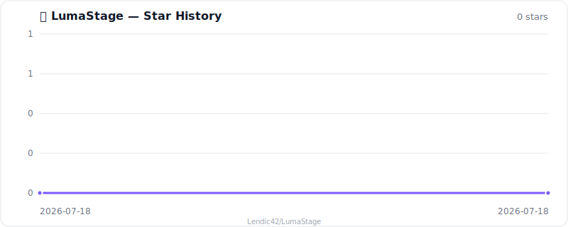

<p align="center">
  
</p>

<h1 align="center">LumaStage</h1>

<p align="center">
  <strong>استوديو VTuber مفتوح المصدر</strong><br>
  سطح مكتب لـ Windows / macOS + متتبع iPhone بـ Face ID
</p>

<p align="center">
  <a href="#-التحميل"></a>
  <a href="https://github.com/Lendic42/LumaStage/releases/latest"></a>
  <a href="#-الرخصة"></a>
</p>

<p align="center">
  <code>Electron</code> · <code>React</code> · <code>SwiftUI</code> · <code>ARKit</code> · <code>GPL-3.0</code>
</p>

<p align="center">
  <a href="README.md">🇷🇺 Русский</a> ·
  <a href="README.en.md">🇬🇧 English</a> ·
  <a href="README.ja.md">🇯🇵 日本語</a> ·
  <a href="README.zh.md">🇨🇳 中文</a> ·
  🇸🇦 <b>العربية</b> ·
  <a href="README.sr.md">🇷🇸 Српски</a>
</p>

<div dir="rtl" lang="ar">

---

## ✨ ما هذا؟

يضع LumaStage نماذج **Live2D** على المسرح (Cubism 3/4/5 ومجلدات VTube Studio) ويتتبع الوجه من **iPhone** عبر الشبكة المحلية.

- 🚫 بلا حساب  
- ☁️ بلا سحابة  
- 💳 بلا اشتراك  
- 🏠 التتبع يبقى على شبكتك المنزلية  

---

## 🧩 المكوّنات

| | الجزء | الوظيفة |
| :---: | --- | --- |
| 🖥️ | **Desktop** | عرض النموذج، الربط، المشاهد، الاختصارات، طبقة OBS |
| 📱 | **Tracker** | TrueDepth + ARKit على iPhone بـ Face ID، تأخير منخفض، LAN |
| 📡 | **Protocol** | TCP / Bonjour مفتوح — `_lumastage._tcp`، المنفذ `39510` |
| 🔌 | **VTS API** | Plugin API لـ VTube Studio — `ws://127.0.0.1:8001` |

> ⚠️ نواة **Live2D Cubism Core** الاحتكارية غير مضمّنة في المستودع.  
> ثبّتها من التطبيق (CDN الرسمي لـ Live2D) أو من Cubism SDK for Web.  
> التفاصيل → [docs/compatibility.md](docs/compatibility.md)

---

## 📦 التحميل

البناءات → **[Releases](https://github.com/Lendic42/LumaStage/releases/latest)**

| 📁 الملف | 🖥️ المنصة |
| --- | --- |
| `LumaStage-macOS-0.1.0.dmg` | 🍎 macOS · مثبّت |
| `LumaStage-macOS-0.1.0.zip` | 🍎 macOS · محمول |
| `LumaStage-Windows-0.1.0-Setup.exe` | 🪟 Windows · مثبّت |
| `LumaStage-Windows-0.1.0-Portable.exe` | 🪟 Windows · محمول |
| `LumaStage-Tracker-0.1.0-unsigned.ipa` | 📱 iPhone · توقيعك أنت |
| `LumaStage-0.1.0-source.zip` | 🧬 مصادر الإصدار |

### 📱 iPhone (Tracker)

ملف IPA **غير موقَّع**. ثبّته عبر Feather / AltStore / Sideloadly / TrollStore بشهادتك.

1. ⬇️ نزّل `LumaStage-Tracker-0.1.0-unsigned.ipa` من الإصدار  
2. ✍️ وقّعه وثبّته على iPhone بـ Face ID  
3. 🖥️ شغّل Desktop واركّب الاقتران برمز من **6 أرقام**  
4. 📶 أبقِ الجهازين على نفس شبكة Wi‑Fi  

> 🔑 أول اتصال: الرمز على سطح المكتب ← التأكيد على iPhone.  
> بعدها يُحفظ رمز جهاز محلي.

### 🖥️ Desktop

1. ⬇️ ثبّت بناء macOS / Windows من الإصدار  
2. 📥 عند أول استيراد للنموذج — نزّل Cubism Core (قبول رخصة Live2D مطلوب)  
3. 📂 استورد مجلدًا يحتوي `*.model3.json` (يمكن مع `*.vtube.json` من VTS)  
4. 📱 وصّل Tracker **أو** اعمل بوضعية محايدة دون iPhone  

---

## ✅ ما المتوفر

| | الميزة |
| :---: | --- |
| 🎭 | استيراد Cubism 3/4/5 وبيانات VTube Studio (الربط، التعبيرات، الحركات، الاختصارات) |
| 🎚️ | معايرة وتنعيم التتبع، محرر حي للوجه → Live2D |
| 🎬 | مشاهد: خلفية، تحويل النموذج، عناصر PNG / JPG / GIF، تثبيت ArtMesh |
| 📹 | طبقة شفافة دائمًا في الأعلى لالتقاط OBS |
| 🧩 | VTS Plugin API محلي (نماذج، اختصارات، عناصر، فيزياء، معالجة لاحقة…) |
| 🔒 | بلا سحابة: اقتران عبر LAN فقط، والرموز على الأجهزة فقط |

📖 مصفوفة الـ API → [docs/compatibility.md](docs/compatibility.md)  
🏗️ البنية → [docs/architecture.md](docs/architecture.md)

---

## 🛠️ التطوير

يتطلب **Node.js 22+**.

```bash
npm install
npm run dev          # desktop
npm test
npm run package:mac  # dmg / zip
npm run package:win  # setup / portable
```

### 📁 الهيكل

```text
apps/desktop           # 🖥️ Electron + React
apps/ios               # 📱 SwiftUI + ARKit tracker
packages/protocol      # 📡 بروتوكول التتبع
packages/vts-api       # 🔌 توافق VTS Plugin API
packages/scene-core    # 🎬 المشاهد
packages/tracking-core
packages/model-compat
docs/                  # 📖 docs
```

مشروع iOS: `apps/ios`. بناء IPA أسهل على Mac مع Xcode.

---

## 📄 الرخصة

مصدر LumaStage الأصلي مرخّص بـ **GPL-3.0-only**.

Live2D Cubism Core والنماذج وأصول الطرف الثالث لها رخصها الخاصة.  
انظر `THIRD_PARTY_NOTICES.md` و [docs/compatibility.md](docs/compatibility.md).

</div>

---

## ⭐ Star History

[](https://www.star-history.com/#LumaStage&Date)

<p align="center">
  Made with 💜 for VTubers · <a href="https://github.com/Lendic42/LumaStage/releases/latest">Download v0.1.0</a>
</p>
