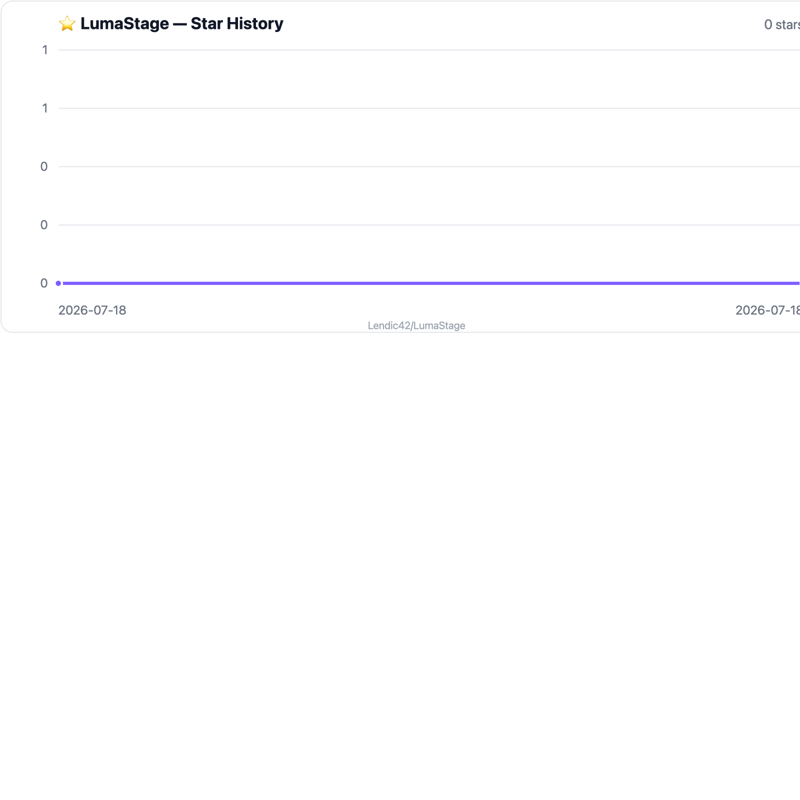

<p align="center">
  
</p>

<h1 align="center">LumaStage</h1>

<p align="center">
  <strong>オープンソースの VTuber スタジオ</strong><br>
  Windows / macOS 用デスクトップ + Face ID iPhone トラッカー
</p>

<p align="center">
  <a href="#-ダウンロード"></a>
  <a href="https://github.com/Lendic42/LumaStage/releases/latest"></a>
  <a href="#-ライセンス"></a>
</p>

<p align="center">
  <code>Electron</code> · <code>React</code> · <code>SwiftUI</code> · <code>ARKit</code> · <code>GPL-3.0</code>
</p>

<p align="center">
  <a href="README.md">🇷🇺 Русский</a> ·
  <a href="README.en.md">🇬🇧 English</a> ·
  🇯🇵 <b>日本語</b> ·
  <a href="README.zh.md">🇨🇳 中文</a> ·
  <a href="README.ar.md">🇸🇦 العربية</a> ·
  <a href="README.sr.md">🇷🇸 Српски</a>
</p>

---

## ✨ これは何？

LumaStage は **Live2D モデル**（Cubism 3/4/5、VTube Studio フォルダ）をステージに載せ、**iPhone** の顔トラッキングをローカルネットワーク経由で受け取ります。

- 🚫 アカウント不要  
- ☁️ クラウド不要  
- 💳 サブスク不要  
- 🏠 トラッキングは自宅 LAN 内に留まる  

---

## 🧩 構成

| | 部分 | 内容 |
| :---: | --- | --- |
| 🖥️ | **Desktop** | モデル描画、マッピング、シーン、ホットキー、OBS オーバーレイ |
| 📱 | **Tracker** | Face ID iPhone の TrueDepth + ARKit、低遅延、LAN |
| 📡 | **Protocol** | 公開 TCP / Bonjour — `_lumastage._tcp`、ポート `39510` |
| 🔌 | **VTS API** | VTube Studio Plugin API — `ws://127.0.0.1:8001` |

> ⚠️ プロプライエタリな **Live2D Cubism Core** は本リポジトリに含まれません。  
> アプリ内（公式 Live2D CDN）または Cubism SDK for Web から導入できます。  
> 詳細 → [docs/compatibility.md](docs/compatibility.md)

---

## 📦 ダウンロード

ビルド → **[Releases](https://github.com/Lendic42/LumaStage/releases/latest)**

| 📁 ファイル | 🖥️ プラットフォーム |
| --- | --- |
| `LumaStage-macOS-0.1.0.dmg` | 🍎 macOS · インストーラ |
| `LumaStage-macOS-0.1.0.zip` | 🍎 macOS · ポータブル |
| `LumaStage-Windows-0.1.0-Setup.exe` | 🪟 Windows · インストーラ |
| `LumaStage-Windows-0.1.0-Portable.exe` | 🪟 Windows · ポータブル |
| `LumaStage-Tracker-0.1.0-unsigned.ipa` | 📱 iPhone · 自分で署名 |
| `LumaStage-0.1.0-source.zip` | 🧬 リリース用ソース |

### 📱 iPhone（Tracker）

IPA は **未署名** です。Feather / AltStore / Sideloadly / TrollStore で自分の証明書を使って入れてください。

1. ⬇️ リリースから `LumaStage-Tracker-0.1.0-unsigned.ipa` を取得  
2. ✍️ Face ID 付き iPhone に署名してインストール  
3. 🖥️ Desktop を起動し、**6 桁コード** でペアリング  
4. 📶 両方を同じ Wi‑Fi に接続  

> 🔑 初回：Desktop のコード → iPhone で確認。  
> その後、端末ごとのローカルトークンが保存されます。

### 🖥️ Desktop

1. ⬇️ リリースの macOS / Windows ビルドをインストール  
2. 📥 初回モデル読み込み時に Cubism Core を取得（Live2D ライセンス同意が必要）  
3. 📂 `*.model3.json` を含むフォルダをインポート（VTS の `*.vtube.json` も可）  
4. 📱 Tracker を接続 **または** iPhone なしのニュートラル姿勢で使用  

---

## ✅ できること

| | 機能 |
| :---: | --- |
| 🎭 | Cubism 3/4/5 と VTube Studio メタデータ（マッピング、expression、motion、hotkey） |
| 🎚️ | トラッキングのキャリブレーション／スムージング、face → Live2D のライブ編集 |
| 🎬 | シーン：背景、モデル変形、PNG / JPG / GIF アイテム、ArtMesh ピン |
| 📹 | OBS 取り込み用の常時最前面透明オーバーレイ |
| 🧩 | ローカル VTS Plugin API（モデル、hotkey、item、physics、ポストプロセス…） |
| 🔒 | クラウドなし：ペアリングは LAN のみ、トークンは端末内 |

📖 API 対応表 → [docs/compatibility.md](docs/compatibility.md)  
🏗️ 構成 → [docs/architecture.md](docs/architecture.md)

---

## 🛠️ 開発

**Node.js 22+** が必要です。

```bash
npm install
npm run dev          # desktop
npm test
npm run package:mac  # dmg / zip
npm run package:win  # setup / portable
```

### 📁 構成

```text
apps/desktop           # 🖥️ Electron + React
apps/ios               # 📱 SwiftUI + ARKit tracker
packages/protocol      # 📡 トラッキングプロトコル
packages/vts-api       # 🔌 VTS Plugin API 互換
packages/scene-core    # 🎬 シーン
packages/tracking-core
packages/model-compat
docs/                  # 📖 docs
```

iOS プロジェクトは `apps/ios`。IPA ビルドは Xcode のある Mac が楽です。

---

## 📄 ライセンス

LumaStage のオリジナルソースは **GPL-3.0-only**。

Live2D Cubism Core、モデル、第三者アセットは各ライセンスに従います。  
`THIRD_PARTY_NOTICES.md` と [docs/compatibility.md](docs/compatibility.md) を参照。

---

## ⭐ Star History

[](https://www.star-history.com/#LumaStage&Date)

<p align="center">
  Made with 💜 for VTubers · <a href="https://github.com/Lendic42/LumaStage/releases/latest">Download v0.1.0</a>
</p>
